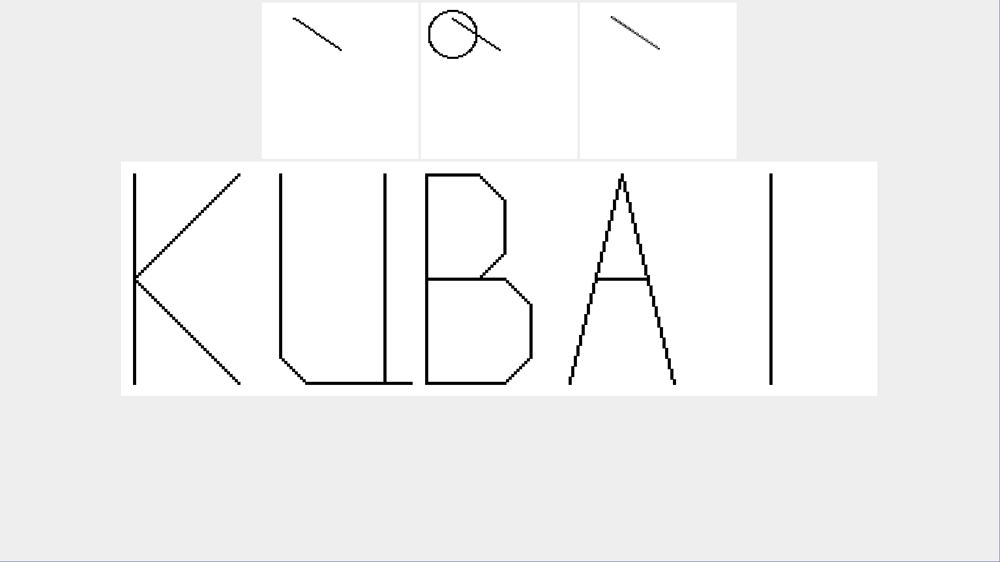
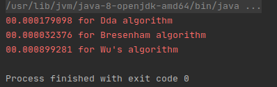

# Лабораторна робота № 1

__Тема__: Алгоритми растрування графічних примітивів

__Мета роботи__: на практичному досвіді ознайомитись із способами растрування графічних примітивів.

__Постановка задачі__:  Програмно реалізувати алгоритми растрування відрізків та кола, що використовують псевдопіксель розміром NxN. 

__Алгоритми для растрування__: 
 * алгоритм ЦДА (цифровий диференціальний аналізатор, DDA) для растрування відрізка;
 * алгоритми Брезенхема для растрування відрізка та кола;
 * алгоритм Ву для растрування відрізка.
 

__Завдання для лабораторної роботи__:

1.  Вивести на екран монітора результати роботи кожного із алгоритмів, що розглядаються.

2.  Оцінити (порівняти) швидкодію кожного із алгоритмів растрування відрізків.

3.  Відтворити на екрані монітора власне прізвище.

#### Результат роботи програми:

