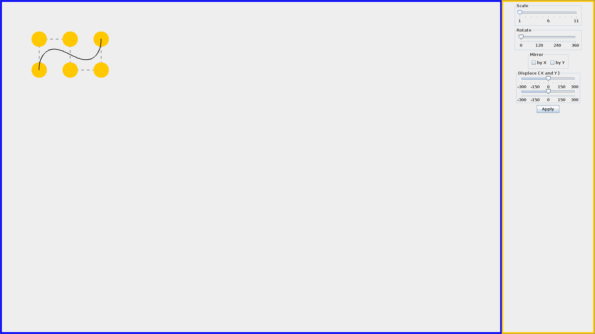
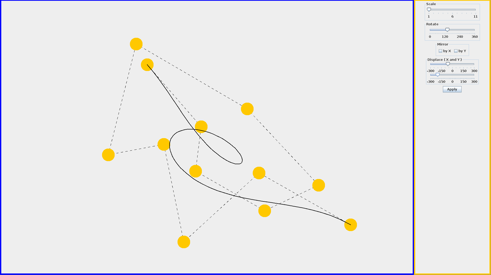

# Лабораторна робота № 2

 

__Тема__: Побудова кривої Безьє.

__Мета роботи__: на практичному досвіді ознайомитись із способами растрування кривих Безьє.

__Постановка задачі__:  Програмно реалізувати алгоритми растрування кривої Безьє  по довільній кількості точок (мінімум 4-м). Застосувати до кривої геометричні перетворення (поворот на кут, масштабування, відображення (відбиття), перенос (зсув)). 

__Завдання для лабораторної роботи__:

1. Задати опорні точки. 

2. Вивести на екран монітора криву Безьє .

3. Реалізувати  задані геометричні перетворення.

#### Результат роботи програми

Опорну точку можна перемістити затиснувши ліву кнопку мишки. Натиск лівою кнопкою на вільне місце створить нову точку,
натиск правою кнопкою на одну з точок видалить її.
Панель справа дозволяє застосовувати трансформації до кривої, для збереження змін необхідно натиснути 'Apply'.

#### Крива після трансформацій:
