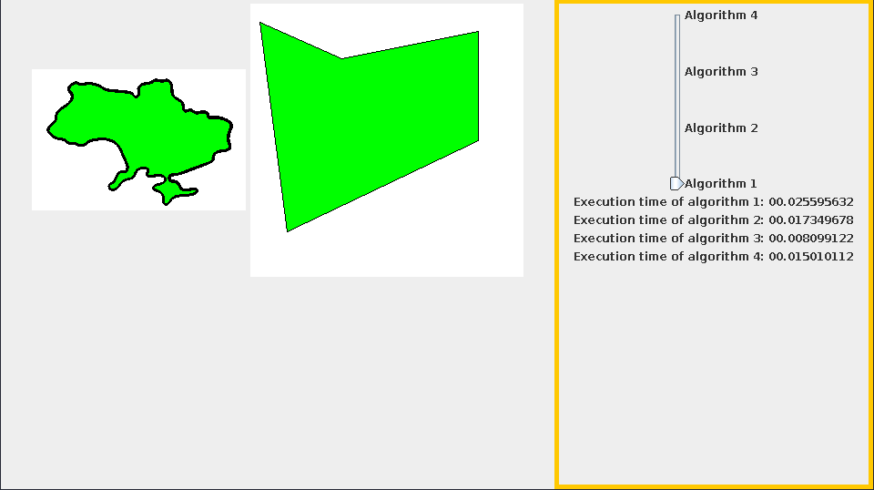

# Лабораторна робота № 3

__Тема:__ Алгоритми заливки заданих  контурів (областей)

__Мета роботи:__ на практичному досвіді ознайомитись із способами заливки довільно заданих контурів (областей) на екрані монітору.

__Постановка задачі:__ Програмно реалізувати 4 різні алгоритми заливки (на вибір) довільно заданих областей на екрані монітору.

 

__Завдання для лабораторної роботи:__

1. Задати області екрану двох видів (многокутник та довільний контур).

2. Заповнити задані області деяким кольором.

3. Порівняти реалізовані алгоритми за швидкодією (на прикладі заповнення одного із контурів) . 

#### Результат роботи програми:


### Важливо:
Для двох із трьох продемонстрованих алгоритмів пам'яті на стеку може не вистачити
в такому разі необхідно збільшити її об'єм використавши опцію віртуальної машини
__-Xss__, наприклад:
```
> java -Xss1G -jar Lab1-1.0-SNAPSHOT-jar-with-dependencies.jar
```
Встановлює максимальний розмір стеку 1 гігабайт.