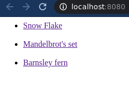
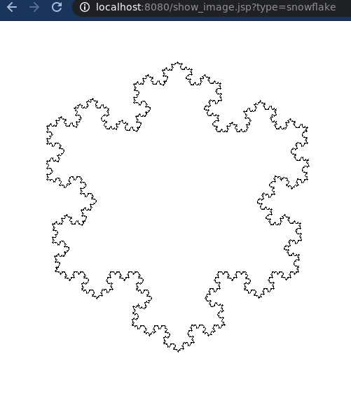
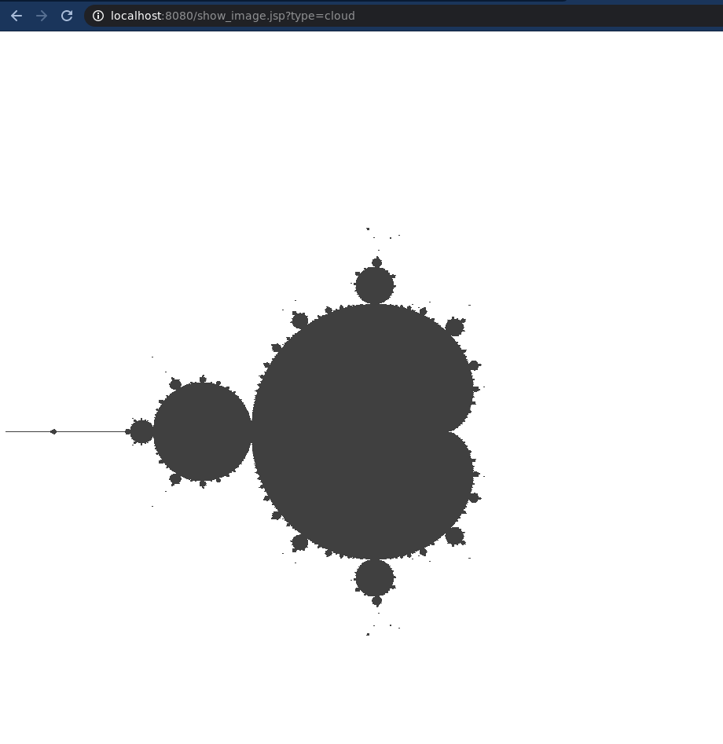
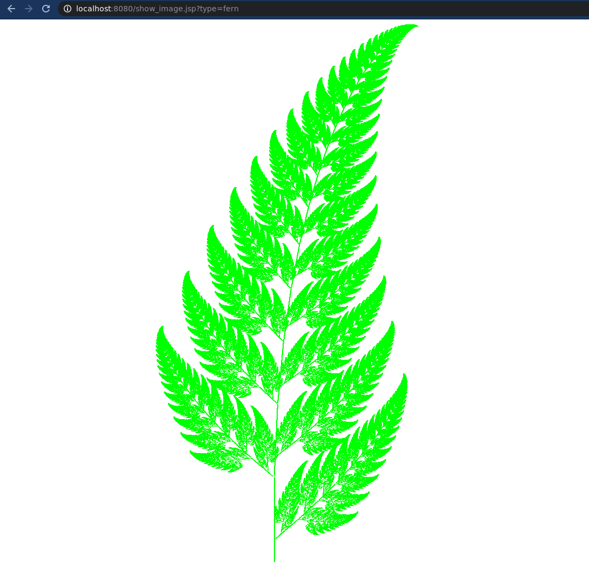

# Лабораторна робота №4
__Тема__: Фрактальна графіка

__Мета роботи__: на практичному досвіді ознайомитись із способами  побудови та видами фракталів.

__Постановка задачі__:  Програмно реалізувати відтворення на екрані монітору фракталів.

__Фрактали для відтворення__:

- крива / сніжинка Коха;

- множина Мандельброта;

- гілка папороті.

__Завдання для лабораторної роботи__:

1.  Вивести на екран монітора кожний із фракталів.

2.  Пояснити правила їхнього відтворення.

#### Результати роботи програми:

